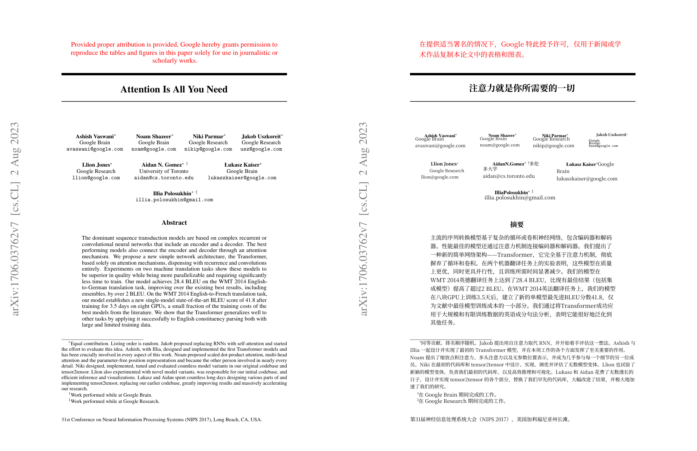

# doc2zh · 文档中英对照翻译

把英文文档翻译成简体中文，输出原文和译文同页并排的 PDF。支持 PDF、PPT、Word，Office 文档会先转成 PDF 再翻译。

翻译用 DeepSeek API，版面解析和重排用 [BabelDOC](https://github.com/funstory-ai/BabelDOC)。
Windows 免安装，模型可随包可单下。



《Attention Is All You Need》第 1 页的实际输出，左边原文，右边译文。作者栏、脚注、arXiv 侧栏这些位置都保留了。

## 和直接用上游的区别

上游 pdf2zh-next 只能处理 PDF，WebUI 一次一个文件，需要装 Python，首次运行还要联网下模型。这个项目补的是这几块：

- 输入支持 PPT 和 Word，调本机 Office 转成 PDF
- 批量提交，带队列和并发控制，并发数按可用内存自动算
- 术语表有管理界面，能导入 CSV、TSV 或直接粘贴
- 打包成免安装 exe，模型可随包可单下，放旁边就自动用

## 安装

### 免安装 exe

发行包分两个文件：

| 文件 | 大小 | 说明 |
|---|---|---|
| `PDF中英对照翻译-vX.Y.Z.zip` | 约 666MB | 主程序，解压即用 |
| `offline_assets_<hash>.zip` | 213MB | 版面模型和字体，可选 |

用法：

1. 把主程序解压到任意目录
2. 双击 `启动（双击这里）.vbs`
3. 等窗口出现（首次 40 到 60 秒，程序在恢复模型和扫描历史任务）

模型资源有两种拿法，二选一：

- **下载上面那个 213MB 的 zip**，直接放在程序目录（和 exe 同级），程序会自动解压，不联网
- **不下载**，让程序首次运行时自己从 HuggingFace 拉（约 340MB 解压后大小，会自动在官方几个源之间测速）

然后在界面里填 DeepSeek 的 API Key（[platform.deepseek.com](https://platform.deepseek.com) 申请），把文件拖进去，点开始翻译。

不用装 Python。除了翻译请求，其他都不需要联网。

### 从源码运行

```
cd pdf-translator
python -m venv .venv
.venv\Scripts\python.exe -m pip install -r requirements.txt
.venv\Scripts\python.exe webapp\prepare_assets.py
.venv\Scripts\python.exe -m uvicorn webapp.server:app --port 8848
```

然后打开 <http://127.0.0.1:8848>。也可以直接双击 `启动.cmd`，它会自动做上面这些。

### 命令行

```
:: 翻一篇，PDF / PPT / Word 都行
.venv\Scripts\python.exe translate.py 讲义.pptx --api-key sk-xxx

:: 只翻前 5 页，并发提到 8
.venv\Scripts\python.exe translate.py 论文.pdf --api-key sk-xxx --pages 1-5 --qps 8
```

输出写到 `output/` 目录，三个文件：

- `xxx.zh-CN.dual.pdf` 中英对照
- `xxx.zh-CN.mono.pdf` 只有译文
- `xxx.zh-CN.glossary.csv` 自动提取的术语表

## 界面

- 拖入 PDF、PPT、Word，可以混着拖，一次最多 20 个
- 并发数按可用内存自动定：超过 8GB 跑 3 个，超过 4GB 跑 2 个，否则 1 个
- 术语表导入支持 CSV、TSV、无表头两列、`原词 => 译词`、直接粘贴，编码自动识别
- 进度分阶段显示，附带原始日志和耗时
- 完成后可以在窗口里预览对照版、原文、仅译文，能翻页
- 下载走系统另存为对话框，失败时自动退回浏览器下载
- 历史任务存在磁盘上，重启后还在，被中断的可以重新翻译

## 实测耗时

| 输入 | 规模 | 耗时 |
|---|---|---|
| Attention Is All You Need | 3 页 | 43 秒 |
| 宏观课件 Ch4 Financial market | 一份 PPT | 22.6 分钟 |
| 宏观课件 Ch7 Labor market | 一份 PPT | 7 分钟 |
| 3 个文件批量，并发上限 2 | 每个 2 页 | 48s / 49s / 36s |

一篇 15 页论文大概几分钱。

## 已知问题

**清单类版面保留不了行结构。** 比如「题干 + a) b) c) d) 选项」，译文会把选项并成一段。

这是 BabelDOC 重排机制决定的，官方 README 的 Known Issues 里写着 "Lines are not supported"。试过六种改法都没用：`split_short_lines` 参数（三种阈值）、翻译器逐行拆分、提示词注入行结构规则、在中间表示层拆段、预处理源 PDF 拉开行距、让翻译在主进程跑以便打补丁。过程记在 [docs/换行问题排查记录.md](docs/换行问题排查记录.md)。

论文正文这种连续长句不受影响，主要是讲义、题库、条目清单这类版面。

其他：

- 人名机构名可能被意译，比如 Google Brain 会翻成中文。可以用术语表强制指定
- 扫描版 PDF 需要 OCR，效果看文档质量
- 表格文字默认不翻，有个实验性开关
- PPT 和 Word 转换走本机 Office 的 COM 接口，没装 Office 会尝试 LibreOffice，都没有就只能先手动转 PDF
- 首次启动慢，40 到 60 秒
- 只在本机用，接口没有鉴权，不要暴露到公网

## 打包时踩过的坑

给需要自己打包或者改代码的人。这些坑都修好了，免得重走一遍。

PyInstaller：

| 报错 | 原因 | 修法 |
|---|---|---|
| `No module named 'bitstring.bitstore_bitarray'` | 这个包用 importlib 动态导入后端，静态分析扫不到 | `collect_submodules('bitstring')` |
| `No module named 'pdf2zh_next.translator.translator_impl'` | 这个目录没有 `__init__.py`，是命名空间包，`collect_submodules` 不会进去 | 手动把子包路径加进 hiddenimports |
| `DLL load failed while importing _hs_ext` | hyperscan 的 .pyd 按完整路径加载，找不到放在 numpy.libs 里的哈希名 MSVC 运行库 | 打包后把运行库复制到 `_internal` 和 `hyperscan/` 下 |
| 打包后任务历史和术语表都读不到 | 打包后 `__file__` 在只读的 `_internal` 里，数据目录跟着错位 | 数据目录统一解析到 exe 同级 |

上游行为：

- 术语表会"不生效"。上游默认会自己提取一份术语表注入提示词，和用户术语表冲突。实测同一页，只给用户术语表时强制译名 0 命中，关掉自动提取后 4 个全命中
- 翻译缓存会掩盖差异。缓存键里的 prompt 是空模板，不含每批的实际内容。同一页先不带术语表翻过，再带术语表翻可能直接命中旧缓存
- 缓存目录改不了。BabelDOC 把 `~/.cache/babeldoc` 硬编码在 `const.py` 里，没有环境变量开关
- Word 的 `PrintOut` 要求文档窗口处于活动状态，报错是"此方法或属性无效，因为文档窗口处于非活动状态"，所以虚拟打印机路线不适合无人值守

Windows 启动器（VBS）：

- 必须存成 UTF-16LE 带 BOM。VBScript 按 ANSI 读 .vbs，UTF-8 的中文会被截断成语法错误
- WMI 的查询结果没有 `.Count` 属性，得用 `For Each` 遍历。直接取 .Count 会让脚本在那行静默失败，表现是双击没反应
- 不能用 `Run(exe, 0, ...)` 隐藏启动，程序自己的窗口也会被藏掉
- 拼双引号容易出错，直接 `Run exePath` 让 WScript 处理带空格的路径

## 目录结构

```
pdf-translator/
├─ 启动.cmd                  源码版启动脚本
├─ launcher.py               PyInstaller 入口，兼做启动窗口和跑单个翻译任务
├─ translate.py              命令行入口
├─ LICENSE
├─ THIRD-PARTY-NOTICES.md
├─ webapp/
│  ├─ server.py              FastAPI 路由
│  ├─ jobs.py                任务队列、并发控制、磁盘恢复
│  ├─ translate_job.py       翻译子进程
│  ├─ office_convert.py      PPT/Word 转 PDF
│  ├─ glossary.py            术语表
│  ├─ pdf_preview.py         页面转 PNG 供预览
│  └─ static/index.html      前端
├─ build/
│  ├─ build.ps1              构建加自检
│  ├─ pdf-translator.spec    PyInstaller 配置
│  ├─ assemble_dist.py       装配发行包
│  ├─ verify_*.py            端到端验证脚本
│  └─ make_office_samples.py 造测试用 PPT/Word
└─ docs/                     截图和排查记录
```

## 接口

| 方法 | 路径 | 说明 |
|---|---|---|
| GET | `/api/health` | 引擎自检 |
| POST | `/api/translate` | 上传单个文件 |
| POST | `/api/translate/batch` | 批量上传，字段名 `files` |
| GET | `/api/jobs/{id}/events` | SSE 进度流 |
| GET | `/api/jobs/{id}` | 任务详情 |
| POST | `/api/jobs/{id}/cancel` | 取消 |
| POST | `/api/jobs/{id}/restart` | 重新翻译 |
| GET | `/api/jobs/{id}/save/{kind}` | 下载，kind 为 dual/mono/glossary/source |
| GET | `/api/jobs/{id}/page/{kind}/{n}` | 第 n 页渲染成 PNG |
| 增删改查 | `/api/glossaries` | 术语表 |

环境变量：

| 变量 | 默认值 | 说明 |
|---|---|---|
| `DEEPSEEK_API_KEY` | 空 | 服务端预置 Key |
| `MAX_UPLOAD_MB` | 100 | 单文件大小上限 |
| `MAX_BATCH_FILES` | 20 | 单批文件数上限 |
| `MAX_CONCURRENT` | 0 | 并发翻译数，0 表示按内存自动 |
| `PORT` | 8848 | 服务端口 |
| `PDF_TRANSLATOR_UI` | window | 改成 browser 用系统浏览器打开 |
| `SOURCE_URL` | 占位符 | 界面页脚展示的源码地址 |

## 自己打包

```
:: 打包加自检
powershell -ExecutionPolicy Bypass -File build\build.ps1

:: 顺便跑一次真实翻译测试
powershell -ExecutionPolicy Bypass -File build\build.ps1 -ApiKey sk-xxx -TranslateTest

:: 轻量版，不带模型，首次运行联网下载约 340MB
powershell -ExecutionPolicy Bypass -File build\build.ps1 -SkipAssets
```

产物在 `dist\PDF中英对照翻译\`。构建过程会修原生依赖、放入官方离线资源包、迁移已有的任务和术语表数据、生成启动器和桌面快捷方式，最后跑一遍自检。

## 许可

AGPL-3.0。这是必须的，不是选的：项目链接了三个 AGPL-3.0 组件，[BabelDOC](https://github.com/funstory-ai/BabelDOC)、[PDFMathTranslate-next](https://github.com/PDFMathTranslate-next/PDFMathTranslate-next) 和 PyMuPDF，AGPL 第 5(c) 条要求整体沿用同一许可。

自己用没有额外义务。分发或者公开下载需要提供完整源码、保留 LICENSE 和版权声明、整体继续 AGPL-3.0。改完部署成网页服务的话，还要向使用者提供你改的那版源码（第 13 条）。

完整许可证见 [LICENSE](LICENSE)，第三方组件和模型字体的来源见 [THIRD-PARTY-NOTICES.md](THIRD-PARTY-NOTICES.md)，逐条对照见 [docs/开源合规检查报告.md](docs/开源合规检查报告.md)。

## 排查记录

- [换行问题排查记录](docs/换行问题排查记录.md)
- [术语表排查记录](docs/术语表排查记录.md)
- [开源合规检查报告](docs/开源合规检查报告.md)
